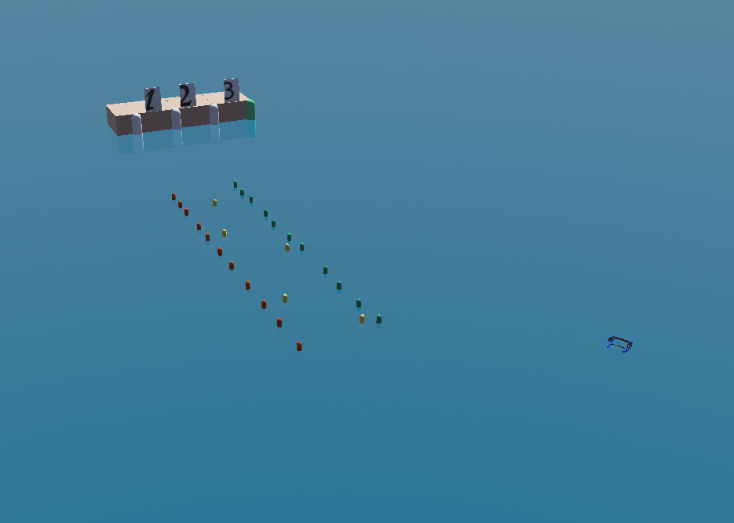
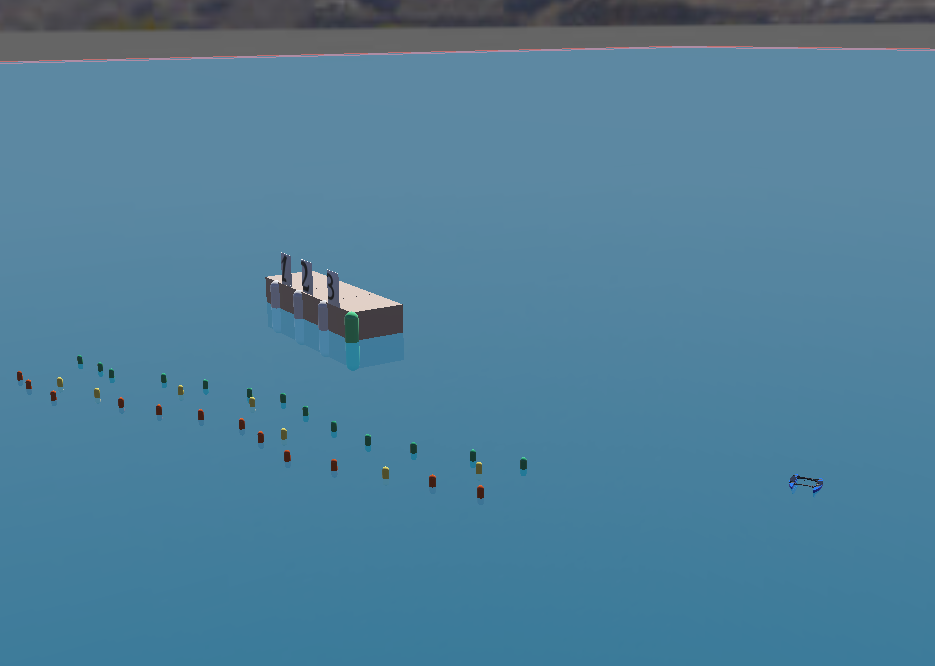
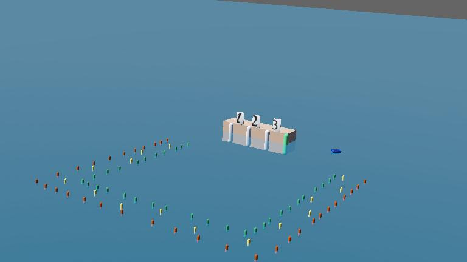
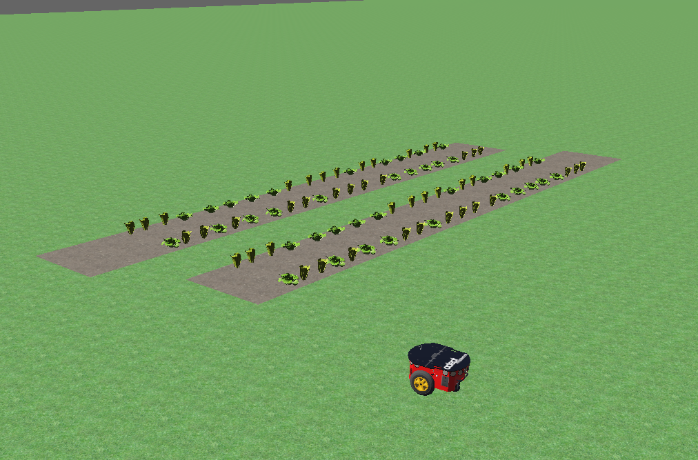

# Teknofest 2025 Yarışma Simülatörü

Arkadaşlar bu yarışma simülatörü tamamen Ardupilot ile Webots2023a kullanarak çalışmalarınızı hızlandıracak alt yapı sunmaktadır.

* Tarımsal İnsansız Kara Aracı Yarışması
* İnsansız Deniz Aracı Yarışması
* Drone ile ilgili yarışmalar

Araçlar;
- İnsansız Hava Aracı (Drone)
- İnsansız Arazi Aracı
- İnsansız Deniz Aracı

Bulunmaktadır.

Her yıl yarışma kurallarına göre editlenerek temsili robotlar üzerinden çalışmanız sağlanacaktır.

Bu repoda yarışmayla ilgili kuralları ardupilot tabanlı kart üzerinden haberleştirerek, `ros2`, `ros` veya `mavlink` ile haberleştirerek çalıştırabilirsiniz.

## İnsansız Deniz Aracı Görevi

### Kolay Görevi

### Orta Görevi

### Zor Görevi

## Tarımsal İnsansız Kara Aracı Yarışması

### Kolay Görev

